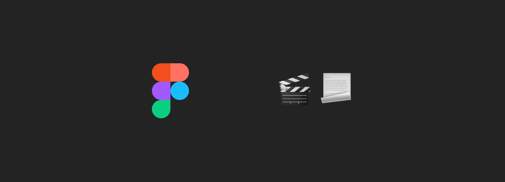

# Video to Frames — Figma Plugin



Extract frames from a video at a chosen interval and place them on your Figma canvas in 9:16 story format.

---

## Features

- **Drag & drop video** support for MP4, MOV, and WebM files
- **Configurable frame interval** — capture every 0.5s up to every 10s
- **Frame preview** — review all extracted frames before inserting
- **Selective insert** — choose which frames to place on the canvas
- **Story format** — frames are placed at 390×844 (9:16), spaced and ready for design
- **WebCodecs-powered** extraction for fast, accurate frame capture

---

## Installation (Development)

1. Open **Figma Desktop** (the plugin requires the desktop app)
2. Go to **Plugins → Development → Import plugin from manifest...**
3. Select the `manifest.json` file from this folder
4. The plugin will appear under **Plugins → Development → Storyboard**

---

## File Structure

```
video-to-story/
├── manifest.json   ← Figma plugin manifest
├── code.js         ← Plugin sandbox code (runs in Figma's JS environment)
├── ui.html         ← Plugin UI (frame extraction with WebCodecs)
└── README.md
```

---

## How to Use

1. **Open the plugin** from Plugins → Development → Storyboard
2. **Drop or select a video** (MP4, MOV, WebM)
3. **Choose an interval** — how often a frame is captured from the video
4. Click **Extract frames** to generate previews
5. **Review the frames** and deselect any you don't want
6. Click **Insert into Figma** — frames are placed on the current page as 390×844 images, spaced out horizontally

---

## Frame Interval Reference

| Interval | Use case |
|----------|----------|
| 0.5s | Fast-paced content, quick cuts |
| 1s | Standard motion |
| 1.5s | Default — balanced detail |
| 2s | Slower content |
| 5s | Long-form video overview |
| 10s | Very long videos, sparse sampling |

A minimum of 2 frames is always extracted regardless of video length.

---

## Important Notes

### Frame extraction
Frames are extracted in the browser using the **WebCodecs API**. If your environment does not support WebCodecs, extraction will not work.

### File size
Large video files (>100 MB) may be slow to process. For best results, use compressed MP4 files.

### Canvas layout
Extracted frames are placed at **390×844** (story format) and spaced out horizontally on the current Figma page, starting centered in the viewport.

---

## Development

No build step required. Edit `code.js` and `ui.html` directly and reload the plugin in Figma with **⌘⌥P** (Mac) or **Ctrl+Alt+P** (Windows).

---

## Credits

Plugin by [asierleoz.com](https://asierleoz.com)
